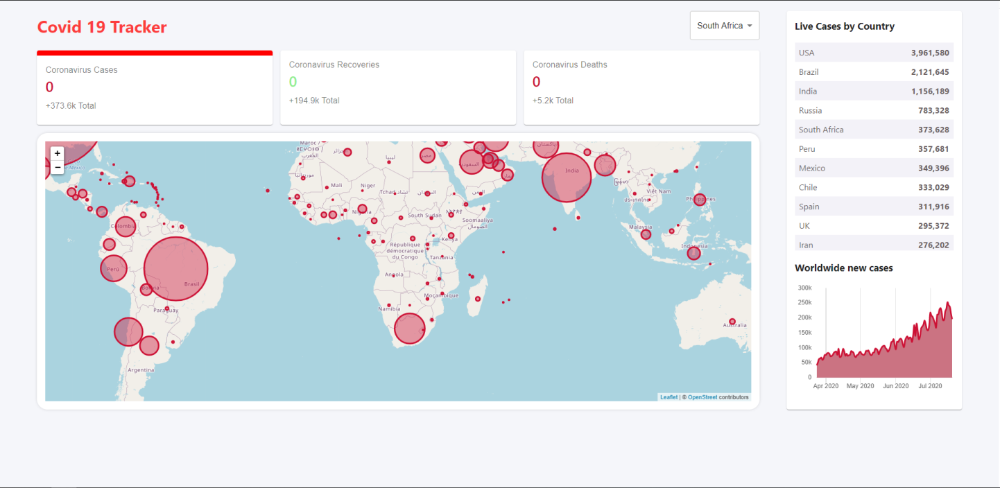

# Covid19 Tracker

## Info

This project was built in React and is getting its data from diseas.sh because they have an API
that can feed the project with data about the current Cases, Recovered and Deaths. You can have a
have a look at the project live hosted with Firebase at https://covid19-tracker-7a4e5.web.app/

## Available Scripts

In the project directory, you can run:

### `npm start`

Runs the app in the development mode. 
Open [http://localhost:3000](http://localhost:3000) to view it in the browser.

The page will reload if you make edits. 
You will also see any lint errors in the console.

## Example Image

